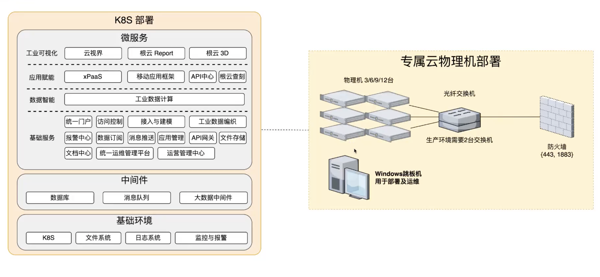

# What is this?

The github.dev web-based editor is a lightweight editing experience that runs entirely in your browser. You can navigate files and source code repositories from GitHub, and make and commit code changes.

There are two ways to go directly to a VS Code environment in your browser and start coding:

* Press the . key on any repository or pull request.
* Swap `.com` with `.dev` in the URL. For example, this repo https://github.com/github/dev becomes http://github.dev/github/dev

Preview the gif below to get a quick demo of github.dev in action.


# Why?
It’s a quick way to edit and navigate code. It's especially useful if you want to edit multiple files at a time or take advantage of all the powerful code editing features of Visual Studio Code when making a quick change. For more information, see our [documentation](https://github.co/codespaces-editor-help).
# rootcloud

## 部署架构




为什么需要 3/6/9 保证高可用写 master可用，https://www.cnblogs.com/jojop/p/14319464.html

zk 3台down一台 还可用，不会导致脑裂。

## 联邦架构

### 数据同步

包含园区的模型数据会路由到集团，集团再同步到园区。同步哦X-Data-Center-Id ，过联邦网关的时候会路由到master，在通过operlog同步到园区。

> 问：
>
> 早上好，有个问题了解下， 比如有三个数据中心，一个集团，一个宁乡，一个长沙。
>
> 我在宁乡创建了一个物模型，首先是路由到集团iothub-api创建，然后operlog同步的时候，会同步到宁乡和长沙，还是值同步到宁乡呢？
>
> 答：
>
> 在集团创建之后，生成oplog，放到kafka 一个topic里，然后宁乡和长沙都有sink，会消费这个topic中的msg，由各自园区的sink写到各自的数据库中。


### 异步服务同步联邦架构


# influxDb

当使用InfluxDB时，你可以执行以下简单操作来插入、查询和删除数据。

首先，确保你已经安装并启动了InfluxDB服务器。然后，你可以按照以下步骤进行简单使用：

1. 连接到InfluxDB服务器：

   ```bash
   $ influx
   ```

2. 创建一个新的数据库：

   ```sql
   > CREATE DATABASE mydb
   ```

3. 选择要使用的数据库：

   ```sql
   > USE mydb
   ```

4. 插入数据：

   ```sql
   > INSERT measurement_name,tag_key=tag_value field_key=field_value timestamp
   ```

   例如，插入一个名为`cpu_usage`的测量值，它具有一个标签`host=server1`，一个字段`value=0.75`，和一个时间戳：

   ```sql
   > INSERT cpu_usage,host=server1 value=0.75 1621789200000000000
   ```

5. 查询数据：

   ```sql
   > SELECT * FROM measurement_name WHERE time > start_time AND time < end_time
   ```

   例如，查询在特定时间范围内的`cpu_usage`数据：

   ```sql
   > SELECT * FROM cpu_usage WHERE time > 1621789200000000000 AND time < 1621792800000000000
   ```

6. 删除数据：

   ```sql
   > DELETE FROM measurement_name WHERE time > start_time AND time < end_time
   ```

   例如，删除在特定时间范围内的`cpu_usage`数据：

   ```sql
   > DELETE FROM cpu_usage WHERE time > 1621789200000000000 AND time < 1621792800000000000
   ```

这只是InfluxDB的基本用法示例。你可以使用更多高级功能来定义数据模型、创建连续查询、设置保留策略等。请查阅InfluxDB的官方文档以获取更多详细信息：https://docs.influxdata.com/influxdb/

## 核心概念：

当使用InfluxDB时，有一些重要的概念需要理解。下面是一些相关概念的解释：

1. 数据库（Database）：InfluxDB中的数据库是数据的逻辑容器。你可以创建多个数据库来组织和管理不同类型的数据。每个数据库都有自己的名称，并且可以独立于其他数据库进行操作。

2. 测量值（Measurement）：测量值是InfluxDB中的基本数据结构。它是具有时间戳的数据集合，类似于关系数据库中的表。每个测量值可以包含多个字段和标签。

3. 标签（Tag）：标签是键值对，用于对测量值进行元数据标记。标签通常用于对数据进行过滤和分组，以便更高效地查询和检索数据。标签的值是索引的，因此在查询中使用标签进行筛选可以提高性能。

4. 字段（Field）：字段是测量值中实际存储的数据。字段可以包含数字、字符串或布尔值等不同类型的数据。字段的值是可查询的，并且可以进行聚合计算。

5. 时间戳（Timestamp）：时间戳是InfluxDB中数据点的关键组成部分。它表示数据点的时间信息，并用于按时间进行排序和查询数据。

6. 保留策略（Retention Policy）：保留策略定义了数据在InfluxDB中的保留期限。它确定了数据保存的时间长度以及数据的精度级别。通过设置保留策略，你可以自动删除过期的数据，以控制数据库的大小和性能。

7. 连续查询（Continuous Query）：连续查询是预定义的查询，定期在InfluxDB中自动运行。你可以创建连续查询来聚合和汇总数据，并将结果保存到新的测量值中。连续查询对于自动化数据处理和生成报告非常有用。

这些是使用InfluxDB时涉及的一些核心概念。了解这些概念可以帮助你更好地理解和操作InfluxDB中的数据。如有需要，你可以参考InfluxDB的官方文档以获取更详细的信息和示例。

## 工业互联网中的例子：

在工业互联网中，InfluxDB可以用于存储各种类型的实时数据。以下是一个示例，展示了使用InfluxDB存储工业互联网中的传感器数据的情况：

假设有一个智能制造设备，通过传感器收集以下数据：

1. 温度（Temperature）：以摄氏度为单位测量的设备温度。
2. 湿度（Humidity）：以百分比表示的设备湿度。
3. 压力（Pressure）：以帕斯卡为单位测量的设备压力。
4. 振动（Vibration）：以加速度为单位测量的设备振动强度。

可以创建一个名为`sensor_data`的测量值，并使用标签来进一步标识数据：

```sql
INSERT sensor_data,device_id=123,location=factory1 temperature=25.6,humidity=60.2,pressure=101325,vibration=0.5 1621789200000000000
```

在这个例子中，我们插入了一个名为`sensor_data`的测量值，它具有以下字段和标签：

- 字段：
  - `temperature`：25.6摄氏度
  - `humidity`：60.2%
  - `pressure`：101325帕斯卡
  - `vibration`：0.5加速度

- 标签：
  - `device_id`：设备ID为123
  - `location`：设备位于`factory1`工厂

通过使用合适的标签和字段，可以为每个设备和测量指标存储相应的数据。这样，你就可以使用InfluxDB进行数据存储、查询和分析，以获得关于设备状态、性能和趋势的实时洞察。

## tdengine例子

以下是使用TDengine进行CRUD（创建、读取、更新、删除）操作的具体示例：

1. 创建数据库：

   ```sql
   CREATE DATABASE mydb;
   ```

2. 使用数据库：

   ```sql
   USE mydb;
   ```

3. 创建表：

   ```sql
   CREATE TABLE mytable (timestamp TIMESTAMP, sensor_id INT, temperature FLOAT, humidity FLOAT);
   ```

4. 插入数据：

   ```sql
   INSERT INTO mytable VALUES ('2023-05-23 10:00:00', 1, 25.6, 60.2);
   ```

5. 查询数据：

   ```sql
   SELECT * FROM mytable;
   ```

6. 更新数据：

   ```sql
   UPDATE mytable SET temperature = 26.2 WHERE sensor_id = 1;
   ```

7. 删除数据：

   ```sql
   DELETE FROM mytable WHERE sensor_id = 1;
   ```

以上示例演示了在TDengine中进行CRUD操作的基本语法。你可以根据自己的需求和数据模型，修改表结构、插入不同的数据、执行各种查询和更新操作。

请注意，TDengine还支持更复杂的查询和过滤条件，例如范围查询、聚合函数等。你可以根据具体的需求使用TDengine提供的丰富功能来处理和分析时序数据。有关更多详细信息和高级用法，请参考TDengine的官方文档。


# flink

## processor例子

以下是一个使用Flink Processor API（处理器API）的Java代码示例：

```java
import org.apache.flink.api.common.functions.MapFunction;
import org.apache.flink.api.common.typeinfo.Types;
import org.apache.flink.streaming.api.datastream.DataStream;
import org.apache.flink.streaming.api.environment.StreamExecutionEnvironment;
import org.apache.flink.streaming.api.functions.ProcessFunction;
import org.apache.flink.util.Collector;

public class FlinkProcessorExample {

    public static void main(String[] args) throws Exception {
        // 创建执行环境
        StreamExecutionEnvironment env = StreamExecutionEnvironment.getExecutionEnvironment();

        // 创建数据流
        DataStream<String> stream = env.socketTextStream("localhost", 9999);

        // 数据处理转换
        DataStream<Integer> result = stream.process(new StringToIntegerProcessFunction());

        // 打印结果
        result.print();

        // 执行作业
        env.execute("Flink Processor Example");
    }

    // 自定义ProcessFunction，将字符串转换为整数
    public static class StringToIntegerProcessFunction extends ProcessFunction<String, Integer> {
        @Override
        public void processElement(String value, Context ctx, Collector<Integer> out) throws Exception {
            int intValue = Integer.parseInt(value);
            out.collect(intValue);
        }
    }
}
```

上述代码使用Flink Processor API创建了一个简单的数据流处理作业。它从本地的9999端口接收数据流，将接收到的字符串转换为整数，并将转换结果打印出来。

在此示例中，我们使用了`ProcessFunction`类来实现自定义的处理逻辑。`processElement`方法接收输入数据并执行所需的处理操作，然后使用`Collector`输出结果。

请注意，`ProcessFunction`类提供了更灵活的功能，例如定时器、状态管理和侧输出等。你可以根据实际需求在`ProcessFunction`中实现更复杂的数据处理逻辑。

此外，还可以使用`ProcessFunction`的其他方法，例如`open`（在函数生命周期内初始化状态）和`close`（在函数生命周期结束时执行清理操作）。这些方法可以用于处理一些初始化和收尾工作。

以上示例展示了如何使用Flink Processor API编写数据流处理作业，可以根据具体需求进行适当的定制和扩展。

# 问题定位

## 连接池满导致：

hikaripool-1 - connection is not available, request timed out after 60000

1、PG:show max_connections;

返回3000

2、select count(1) from pg_stat_activity

返回335.

判断不是pg问题

3、qa-group环境偶现报错：hikaripool-1 - connection is not available, request timed out after 60000，导致连接一直连不上。

4、local复现：

```
spring.datasource.hikari.minimum-idle=${datasource-minimum-idle:1}
spring.datasource.hikari.maximum-pool-size=${datasource-maximum-pool-size:1}
```

在spring的reader方法里设置等待

```
@Override
public Object read()
    throws Exception {
  Thread.sleep(1000*60*60);
  JobResultLogDetail jobResultLogDetail = null;
```

发起任务请求，复现该问题。

5、通过arthas查看线程栈，找不到相关信息。

6、查询正在执行的sql

SELECT 
  procpid, 
  start, 
  now() - start AS lap, 
  current_query 
FROM 
  (SELECT 
    backendid, 
    pg_stat_get_backend_pid(S.backendid) AS procpid, 
    pg_stat_get_backend_activity_start(S.backendid) AS start, 
    pg_stat_get_backend_activity(S.backendid) AS current_query 
  FROM 
    (SELECT pg_stat_get_backend_idset() AS backendid) AS S 
  ) AS S 
WHERE 
  current_query <> '<IDLE>' 
ORDER BY 
  lap DESC;


发现刚好有10条语句正在执行：select status   from job_result_log_detail  where business_id =$1 and business_key=$2

7、考虑是否是死锁问题：

```sql
   SELECT * FROM pg_stat_activity where wait_event_type = 'Lock';
```

查询无数据，排除

8、通过sql反查，找到是，这里一直死循环

```java
if (StringUtils.isNotBlank(relTaskId)) {
  JobResultLogDetailGroupResult result =
      jobResultLogDetailMapper.selectByIdAndKey(relTaskId, modelId);
```

9、发现有依赖关系，由于发布动作提前，导致把10个连接池占满，但是在doAfterJob后失败，导致publish一直在死循环占用连接。

10、

​	解决办法，sprintBatch去掉事务

​	死循环加入超时限制


## 测试用例一直跑过不过问题


场景：接入了iam的sdk，然后测试用例一直跑不过

1、开始根据报错，和gradlew rootcloud-hub-api-common:dependencies >  ~/Desktop/abc.txt exludes了一些类：

```java
implementation("com.rootcloud:iam-sdk-spring-boot-starter:${iamLicenseSdkVersion}") {
    exclude module: 'slf4j-simple'
    exclude module: 'spring-data-mongodb'
}
```

2、发现PrepareContextAspectTest还是一直跑不过，提示：

cannot find javax.faces.context.FacesContext


3、通过开起连个idea，master和分支的debug后对比发现，mock-maker类不一样，导致走到了不同的初始化逻辑。

4、继续debug，发现可能是某个配置改动了实现类导致

5、查看iam的sdk，发现配置了mockito.mock-maker-class=mock-maker-inline

6、暂时先屏蔽掉这个测试类，等iam升级sdk后放开


额外：调用setB的时候不会加载C，[初始化只有几个状态才会进行](https://blog.csdn.net/m0_46316970/article/details/123585896)：

（1）当遇到 new 、 getstatic、putstatic 或 invokestatic 这 4 条直接码指令时，比如 new 一个类，读取一个静态字段(未被 final 修饰)、或调用一个类的静态方法时。

当 jvm 执行 new 指令时会初始化类。即当程序创建一个类的实例对象。
当 jvm 执行 getstatic 指令时会初始化类。即程序访问类的静态变量(不是静态常量，常量会被加载到运行时常量池)。
当 jvm 执行 putstatic 指令时会初始化类。即程序给类的静态变量赋值。
当 jvm 执行 invokestatic 指令时会初始化类。即程序调用类的静态方法。

```java
package com.rootcloud.platform.asyncbatchtask;

public class A {
  public static final Boolean b = "A".equals("B");

  static {
    System.out.println("STATIC A");
  }

  public static void setB() {
    if (b) {
      C.getC();
    }
  }

  private static class C {
    static {
      System.out.println("STATIC CC----");
    }

    public static void getC() {
      System.out.println("C");
    }
  }
}
```

```java
public class B {
  public static void main(String[] args) {
    A.setB();
  }
}
```


## 发布太慢问题

### 1、查看大模型异步发布核心代码耗时

```sh
trace com.rootcloud.platform.business.support.event.handler.DeviceTypeActivateHandler handle
```


Affect(class count: 1 , method count: 1) cost in 453 ms, listenerId: 1
`---ts=2023-06-06 14:41:18;thread_name=ModelStateMachine-0;id=212;is_daemon=false;priority=5;TCCL=org.springframework.boot.web.embedded.tomcat.TomcatEmbeddedWebappClassLoader@5911e990
    `---[42483.16833ms] com.rootcloud.platform.business.support.event.handler.DeviceTypeActivateHandler:handle()
        +---[0.00% 0.095781ms ] com.rootcloud.platform.business.support.event.DomainMessage:getOperator() #44
        +---[0.00% 0.009377ms ] com.rootcloud.platform.business.support.event.DomainMessage:getProcessPayload() #45
        <font color=red>+---[91.29% 38781.297016ms ] com.rootcloud.platform.business.tmodel.operator.ModelOperator:activate() #45</font>
        +---[0.00% 0.028864ms ] com.rootcloud.platform.business.support.HandleResult:ofSuccess() #46
        +---[0.00% 0.01082ms ] com.rootcloud.platform.contexts.LocalContext$IContextInstance:getInstance() #49
        +---[0.00% 0.013014ms ] com.rootcloud.platform.contexts.LocalContext:getCtx() #49
        +---[0.00% 0.027141ms ] com.rootcloud.platform.business.support.operator.DeviceTypeOperator:getInstance() #50
        +---[0.00% 0.009288ms ] com.rootcloud.platform.business.support.event.DomainMessage:getObjectId() #51
        +---[0.00% 0.092093ms ] com.rootcloud.platform.utils.ControllerUtil:getTenantId() #51
       <font color=red> +---[8.71% 3700.858108ms ] com.rootcloud.platform.business.support.operator.DeviceTypeOperator:resolveBuildByBusinessId() #50</font>
        `---[0.00% 0.03207ms ] com.rootcloud.platform.business.support.HandleResult:setResolvedType() #52


重点分析

com.rootcloud.platform.business.tmodel.operator.ModelOperator:activate()

com.rootcloud.platform.business.support.operator.DeviceTypeOperator:resolveBuildByBusinessId()


#### 1.1resolveBuildByBusinessId

```sh
trace com.rootcloud.platform.business.support.operator.PhysicalInterfaceOperator resolveBuild
```


Press Q or Ctrl+C to abort.
Affect(class count: 2 , method count: 5) cost in 376 ms, listenerId: 2
`---ts=2023-06-06 14:51:57;thread_name=ModelStateMachine-0;id=1a8;is_daemon=false;priority=5;TCCL=org.springframework.boot.web.embedded.tomcat.TomcatEmbeddedWebappClassLoader@3700ec9c
    `---[3520.192774ms] com.rootcloud.platform.business.support.operator.PhysicalInterfaceOperator$$EnhancerBySpringCGLIB$$87f075c0:resolveBuild()
        `---[100.00% 3520.044395ms ] org.springframework.cglib.proxy.MethodInterceptor:intercept()
            `---[100.00% 3519.948033ms ] com.rootcloud.platform.business.support.operator.PhysicalInterfaceOperator:resolveBuild()
                +---[0.00% 0.018695ms ] com.rootcloud.platform.PhysicalInterface:getInterfaceId() #73
                +---[0.00% 0.005911ms ] com.rootcloud.platform.PhysicalInterface:getInterfaceId() #75
                +---[0.00% 0.161715ms ] org.slf4j.Logger:info() #74
                +---[0.00% 0.007234ms ] com.rootcloud.platform.PhysicalInterface:getInterfaceId() #77
                +---[0.83% 29.380447ms ] com.rootcloud.platform.repository.PhysicalInterfaceRepository:findPiByPiIdAndTenantId() #77
                +---[0.00% 0.016692ms ] com.rootcloud.platform.PhysicalInterface:getEventTypes() #79
                +---[0.00% 0.017563ms ] com.rootcloud.platform.PhysicalInterface:getSchema() #86
                <font color=red>`---[0.00% 0.013496ms ] com.rootcloud.platform.PhysicalInterface:getPropertyMappings() #89</font>

发现getPropertyMappings使用了迭代查询mongoDb

```sh
monitor com.rootcloud.platform.business.support.operator.ExpressionOperator resolveBuild "params.length==3 && params[0].getExpressionId().contains('1flco2nJgVG')"
```


```shell
--------------------------------------------------------------------------------------------------------------------------------------------
 2023-06-06 16:18:29   com.rootcloud.platform.busines  resolveBuild                    4198       4198       0         1.24       0.00%     
                       s.support.operator.ExpressionO                                                                                       
                       perator                                                                                                              
 2023-06-06 16:18:29   com.rootcloud.platform.busines  resolveBuild                    4198       4198       0         1.33       0.00%     
                       s.support.operator.ExpressionO                                                                                       
                       perator$$EnhancerBySpringCGLIB                                                                                       
                       $$fddf98fc                                                                                                           

 timestamp             class                           method                          total      success    fail      avg-rt(ms  fail-rate 
  
```

<font color=red>发现单次调用只有1ms多，只是调用次数太多，可以考虑作为优化项</font>


#### 1.2ModelOperator:activate


```sh
 trace com.rootcloud.platform.business.tmodel.executor.DeviceTypeActivateExecutor activate "params.length==1 && params[0].getClass().getSimpleName().contains('PhysicalModelGroupNew')"
```


Press Q or Ctrl+C to abort.
Affect(class count: 1 , method count: 2) cost in 251 ms, listenerId: 13
`---ts=2023-06-06 16:42:44;thread_name=ModelStateMachine-0;id=212;is_daemon=false;priority=5;TCCL=org.springframework.boot.web.embedded.tomcat.TomcatEmbeddedWebappClassLoader@5911e990
    `---[36573.814928ms] com.rootcloud.platform.business.tmodel.executor.DeviceTypeActivateExecutor:activate()
        +---[0.00% 0.012694ms ] com.rootcloud.platform.business.tmodel.ds.PhysicalModelGroupNew:getDeviceTypeId() #93
        +---[0.00% 0.002765ms ] com.rootcloud.platform.business.tmodel.ds.PhysicalModelGroupNew:getPhysicalInterfaceId() #94
        +---[0.00% 0.002845ms ] com.rootcloud.platform.business.tmodel.ds.PhysicalModelGroupNew:getDeviceTypeMap() #95
        +---[0.00% 0.007224ms ] com.rootcloud.platform.DeviceType:getTenantId() #97
        +---[0.01% 1.831397ms ] com.rootcloud.platform.services.DeviceTypeService:getDeviceTypeWithoutQueryFilter() #97
        +---[0.00% 0.012513ms ] com.rootcloud.platform.DeviceType:getDeviceTypeId() #99
        +---[0.00% 0.117652ms ] org.slf4j.Logger:info() #99
        +---[0.00% 0.007324ms ] com.rootcloud.platform.dto.InvalidateCache:<init>() #101
        +---[1.67% 611.704369ms ] com.rootcloud.platform.business.tmodel.ds.PhysicalModelGroupBuilder:build() #104
        +---[0.74% 269.171342ms ] com.rootcloud.platform.business.tmodel.executor.DeviceTypeActivateExecutor:reactivate() #107
        +---[1.68% 615.887374ms ] com.rootcloud.platform.business.tmodel.ds.PhysicalModelGroupBuilder:build() #109
        +---[0.04% 12.966458ms ] com.rootcloud.platform.business.tmodel.ds.PhysicalModelGroupNew:buildIncreInvalidateCache() #110
       <font color=red> +---[92.37% 33781.443919ms ] com.rootcloud.platform.business.tmodel.algo.GroupingAlgo:grouping() #116</font>
        +---[2.54% 929.097773ms ] com.rootcloud.platform.business.tmodel.ds.PhysicalModelGroupNew:convert2Status() #117
        +---[0.83% 302.934418ms ] com.rootcloud.platform.business.tmodel.executor.DeviceTypeActivateExecutor:updateHistory() #117
        +---[0.00% 0.002955ms ] com.rootcloud.platform.DeviceType:getDeviceTypeId() #118
        +---[0.00% 0.132029ms ] org.slf4j.Logger:info() #118
        +---[0.00% 0.018354ms ] com.rootcloud.platform.business.support.event.DomainEvent:name() #123
        +---[0.00% 0.078988ms ] com.rootcloud.platform.utils.StrUtil:append() #121
        +---[0.00% 0.017344ms ] com.rootcloud.platform.utils.ControllerUtil:getRequestAt() #124
        +---[0.00% 0.006072ms ] com.rootcloud.platform.utils.ControllerUtil:getTenantId() #125
        `---[0.13% 47.881501ms ] com.rootcloud.platform.subscribe.DataSubscribeSenderContext:storeRetryData() #126


##### 1.2.1

```SH
trace com.rootcloud.platform.business.tmodel.algo.GroupingAlgo grouping
```


Affect(class count: 2 , method count: 2) cost in 402 ms, listenerId: 1
`---ts=2023-06-06 16:57:37;thread_name=ModelStateMachine-1;id=1f6;is_daemon=false;priority=5;TCCL=org.springframework.boot.web.embedded.tomcat.TomcatEmbeddedWebappClassLoader@2002348
    `---[31613.013393ms] com.rootcloud.platform.business.tmodel.algo.GroupingAlgo$$EnhancerBySpringCGLIB$$fc702ae0:grouping()
        `---[100.00% 31612.612929ms ] org.springframework.cglib.proxy.MethodInterceptor:intercept()
            `---[99.99% 31610.695106ms ] com.rootcloud.platform.business.tmodel.algo.GroupingAlgo:grouping()
                +---[0.00% 0.027271ms ] com.rootcloud.platform.business.tmodel.ds.PhysicalModelGroupNew:getDeviceTypeId() #61
                +---[0.00% 0.007584ms ] com.rootcloud.platform.business.tmodel.ds.PhysicalModelGroupNew:getPhysicalInterfaceId() #62
                +---[0.00% 0.007614ms ] com.rootcloud.platform.business.tmodel.ds.PhysicalModelGroupNew:getPhysicalInterface() #63
                +---[0.00% 0.027172ms ] com.rootcloud.platform.grouping.graph.BestGroupCalculator:<init>() #64
                +---[0.00% 0.010901ms ] com.rootcloud.platform.grouping.graph.BestGroupCalculator:getMapper() #66
                +---[0.00% 0.016841ms ] com.rootcloud.platform.PhysicalInterface:getTenantId() #68
                +---[0.14% 45.515693ms ] com.rootcloud.platform.services.PhysicalInterfaceService:getPhysicalInterfaceByStatusWithoutQueryFilter() #68
                +---[0.00% 0.025147ms ] com.rootcloud.platform.business.tmodel.ds.PhysicalModelGroupNew:getDeviceTypeMap() #70
                +---[0.00% 0.009177ms ] com.rootcloud.platform.business.tmodel.ds.PhysicalModelGroupNew:getDeviceTypeMap() #72
                +---[0.00% 0.28146ms ] org.slf4j.Logger:info() #74
                +---[0.00% 0.013155ms ] com.rootcloud.platform.grouping.graph.mgr.GraphMgr:getInstance() #83
                +---[0.00% 0.011532ms ] com.rootcloud.platform.business.tmodel.ds.PhysicalModelGroupNew:getSchemaMap() #84
                +---[0.00% 0.012223ms ] com.rootcloud.platform.business.tmodel.ds.PhysicalModelGroupNew:getExpressionMap() #85
                +---[0.00% 0.007785ms ] com.rootcloud.platform.business.tmodel.ds.PhysicalModelGroupNew:getAlarmTypeMap() #85
                +---[0.00% 0.008335ms ] com.rootcloud.platform.business.tmodel.ds.PhysicalModelGroupNew:getRuleMap() #85
                +---[0.00% 0.008075ms ] com.rootcloud.platform.business.tmodel.ds.PhysicalModelGroupNew:getEventTypeMap() #86
                +---[0.00% 0.013115ms ] com.rootcloud.platform.grouping.graph.ModelGraphCreator:<init>() #86
               <font color=red> +---[51.44% 16260.051226ms ] com.rootcloud.platform.grouping.graph.ModelGraphCreator:create() #87</font>
                +---[0.00% 0.028022ms ] com.rootcloud.platform.business.tmodel.algo.GroupingAlgo:isForceFullGrouping() #88
               <font color=red> +---[48.41% 15302.684596ms ] com.rootcloud.platform.business.tmodel.algo.GroupingAlgo$GroupingPolicy:execute() #89</font>
                `---[0.00% 0.145224ms ] org.slf4j.Logger:info() #98


###### 1.2.1.1 ModelGraphCreator:create()

通过分析ModelGraphCreator:create()主要耗时在

**com.rootcloud.platform.grouping.graph.ModelGraphCreator#buildDependencies**

```
Set<String> refProps = RefHandler.fromExp(expression).getStrategy().execute(expression);
root.setCurrentLoad(RefHandler.fromExp(expression).getLoad(expression));
```

此处递归调用RootvyLangParser解析表达式，应该没有优化空间。


###### 1.2.1.2 GroupingPolicy:execute() 

主要一些算法和数据库操作，暂时无优化空间。

### 2.大模型同步发布。

通过日志定位到是DataServiceRegistry太慢，由于是动态代理类，生成的类较多，不好定位。

查看生成的所有类：sc  *.IDataService\*

1、生产火焰图：


## linux修改不了密码

````sh
"passwd：Authentication token manipulation error"错误通常是由于/etc/shadow文件中与用户相关的字段出现问题所致。这可能是因为文件权限或文件内容出现问题，导致无法成功更新用户密码，因此出现了上述错误。

以下是一些可能的解决方法：

1. 检查文件权限：确保只有root用户具有编辑/etc/shadow文件的权限。如果其他用户或组也具有权限，则必须删除这些权限。

```
$ ls -l /etc/shadow
-rw-r----- 1 root shadow 1344 Dec  1 15:04 /etc/shadow
```

2. 检查文件内容：如果文件内容出现问题，也可能导致此错误。检查/etc/shadow文件是否存在任何错误或无效条目。可以使用“pwck”命令检查此文件。

```
$ sudo pwck /etc/passwd
$ sudo pwck /etc/shadow
```

3. 检查文件系统错误：如果文件系统发生错误，则可能导致此错误。使用“fsck”命令检查文件系统，并解决任何错误。

```
$ sudo fsck /dev/sda1
```

4. 检查磁盘空间：如果磁盘空间不足，则可能无法更新密码。使用“df -h”命令检查可用磁盘空间，并确保有足够的空间。

如果这些方法都无法解决问题，可以尝试重新生成/etc/shadow文件。但是，请注意此操作可能会将用户密码重置为默认密码，并且可能导致数据丢失等问题。因此，建议在尝试此方法之前备份重要数据。

5、df -i 查看inode使用情况

6、pwconv 密码文件（/etc/passwd和/etc/shadow）不同步
echo 867189363@Jzh.com | passwd root --stdin

7、
lsattr /etc/passwd /etc/shadow
chattr -i /etc/passwd /etc/shadow

8、最终原因：密码策略变更导致的问题：
对比两个问题发现密码策略被改了：
使用能更新成功的密码策略：
password    requisite     pam_pwquality.so try_first_pass local_users_only retry=3 authtok_type=
password    sufficient    pam_unix.so sha512 shadow nullok try_first_pass use_authtok
password    required      pam_deny.so
password required pam_cracklib.so dcredit=-1 ucredit=-1 ocredit=-1 lcredit=0 minlen=8
````

## 忘记vmware root密码

https://blog.csdn.net/Ruishine/article/details/129048890

主要注意

1、第一步选对，按e

2、linux‘开头的行  ro为rw，init = /bin.sh

3、第三步chroot /sysroot

4、修改密码

5、 **touch /.autorelabel** 

6、exit 

7、reboot


## nat模式访问步了网络

在 MacBook 上的虚拟机软件中，连接网络适配器的含义是将虚拟机与宿主机的网络进行连接，以实现虚拟机与外部网络的通信。不同的网络适配器选项提供不同的网络连接方式和功能。

以下是一些常见的虚拟机网络适配器选项及其含义：

1. NAT（Network Address Translation）：NAT 是一种常见的网络适配器选项。使用 NAT 时，虚拟机会共享宿主机的 IP 地址，并通过宿主机的网络连接访问外部网络。这种方式使得虚拟机可以与外部网络通信，但外部网络无法直接访问虚拟机。

2. 桥接模式（Bridged Mode）：使用桥接模式时，虚拟机的网络接口会与宿主机的物理网络接口桥接连接，就像虚拟机是直接连接到网络中的一台独立计算机一样。这样，虚拟机可以获得自己的 IP 地址，并且可以直接与外部网络通信，就像它是网络中的另一台设备。

3. 主机模式（Host-Only Mode）：主机模式下，虚拟机与宿主机之间会创建一个专用的虚拟网络，只有宿主机和虚拟机之间可以进行通信。虚拟机可以通过宿主机来访问外部网络，但外部网络无法直接访问虚拟机。

4. 内部网络（Internal Network）：内部网络是一个独立的虚拟网络，只有虚拟机之间可以相互通信，而无法访问宿主机或外部网络。这种模式适用于创建隔离的虚拟网络环境，其中多个虚拟机可以进行内部通信。

5. 仅主机（Host-Only）：仅主机模式是主机模式的一种变体，其中虚拟机只能与宿主机进行通信，无法直接访问外部网络。与主机模式不同的是，仅主机模式下的虚拟机无法通过宿主机来访问外部网络。

这些不同的网络适配器选项提供了不同的网络连接功能，您可以根据需要选择适合您的虚拟机网络配置的适配器类型。具体选项和配置方法可能会因使用的虚拟机软件而有所不同。


netstat -nr

arp -a -d

route delete -net xxx -gateway xxx

 

## load Average

假设系统有 8 个 CPU 核心，那么 Load Average 的含义就有了所谓 "CPU 使用率" 的概念，它表示当前 CPU 使用率占总 CPU 数量的百分比。

一般来说，如果 Load Average 的值小于 1，说明系统 CPU 处理能力还有很大的闲置，如果 Load Average 的值超过 1，说明系统 CPU 处理能力已经不够使用了。如果 Load Average 的值持续大于 1，说明系统的 CPU 处理能力严重不足，需要及时进行调优或者进行资源增加来扩容。

对于一个有 8 个 CPU 核心的系统，如果 Load Average 的值为 8，表示系统 CPU 正在全力运转，但 CPU 数量正好够用，如果 Load Average 的值为 16，则表示 CPU 数量已经不够使用了，可能会出现进程响应缓慢、系统卡顿等问题。如果 Load Average 的值大于 8，说明 CPU 性能已经出现了瓶颈，需要进行进一步的性能调优或资源增加来提高系统的 CPU 处理能力。


是的，在 Load Average 的计算中，除了正在执行 CPU 指令的进程数之外，还会计算等待 I/O 的进程数。

如果系统中有许多进程正在等待进行 I/O 操作，比如等待读写磁盘、网络传输等，那么这些等待 I/O 的进程也会被计算在 Load Average 中，进而增加系统的负载情况。此时 Load Average 会比较高，但不代表 CPU 工作饱和。

如果您在登录 IO 负载下的系统时，Load Average 较高，说明该系统可能正在经历 I/O 性能瓶颈，也可能是因为系统正处于高 I/O 负载状态，导致等待 I/O 的进程增多，进而影响了整个系统的运行效率。此时，您可以通过一些工具（比如 `iostat`、`iotop` 等）来查看系统中磁盘、网络等 I/O 操作的情况，帮助找到问题并进行解决。


````sh
在 Linux 中，可以使用一些工具来分析系统的 I/O 瓶颈情况，常用的工具有 `iostat` 和 `iotop`。

下面是使用这两个工具分析 I/O 瓶颈的简要步骤：

1.使用 `iostat` 命令查看磁盘 I/O 情况。该命令的用法如下：

```
iostat -x 5
```
该命令会每 5 秒钟打印一次 I/O 统计信息，其中 `-x` 参数表示打印的信息中包含磁盘的详细信息，如每个分区的 I/O 使用率、读写延迟、I/O 请求队列长度等。通过观察输出结果，可以了解各个磁盘的 I/O 情况，找出占用磁盘 I/O 资源的进程。

2.使用 `iotop` 命令查看磁盘 I/O 的实时状态。该命令的用法如下：

```
iotop -o
```

该命令会实时显示各个进程的 I/O 统计信息，包括每个进程的 I/O 请求量、I/O 使用率等。使用该命令可以快速查找占用 I/O 资源的进程，并了解其 I/O 的类型和使用情况。

总的来说，通过 iostat 和 iotop 这两个工具，可以深入了解系统的 I/O 瓶颈情况，找到 I/O 瓶颈的主要原因并进行逐步优化，提高整个系统的运行效率。
````


# cicd

## gitlab

### 报错集合

1、fatal: git fetch-pack: expected shallow list fatal: The remote end hung up unexpectedly

解决方法：

```bash
yum install http://opensource.wandisco.com/centos/7/git/x86_64/wandisco-git-release-7-2.noarch.rpm
yum install git -y

```


提示无权限：

```json
{
  "name": "my-tribute-package",
  "version": "1.0.0",
  "description":
  "This is not the best package in the world, this is just a tribute.",
  "main": "index.js",
  "author": "Yarn Contributor",
  "license": "MIT",
  "scripts": {
    "test": "scripts/test.sh" //chmod +x scripts/test.sh
  }
}
```


### 重置密码后报错：

Unable to authenticate, need: BASIC realm="Sonatype Nexus Repository Manager"

1、npm config list

2、vi /home/gitlab-runner/.npmrc

删除：//192.168.227.10:8081/repository/npm/:_authToken = (protected) 

3、重新认证

npm login --registry=http://192.168.227.10:8081/repository/npm/ 


gitlab-runner本质是在linux的gitlab-runner用户执行runner任务。


### 修改url

git remote -v

git remote set-url --pull  origin http://192.168.227.9/root/gitrunner.git


## 安装nexus

https://blog.csdn.net/bigtree_3721/article/details/78924685

注意需要对应的版本：https://download.sonatype.com/nexus/3/nexus-3.3.1-01-unix.tar.gz

## gradlew

No candidates found for method call plugins.

find->action->reload all gradle projects


## JAVA_OPTS_MEM

通过oam的trait注入，基础java镜像中读取并计算写入到JAVA_OPTS_MEM中

通过可以看到内存被注入到容器里：describe pods |grep RESOURCE_LIMITS_MEMORY

RESOURCE_LIMITS_MEMORY:                      4294967296 (limits.memory)

# linux

## 安全

### fail2ban

1、安装

https://www.cpweb.top/1379

开启firewalld/禁用iptables 否则会混乱（两者默认拒绝所有）

vim /etc/fail2ban/jail.conf

enabled  = true 


错误：提示没有可用软件包 fail2ban 

wget https://dl.fedoraproject.org/pub/epel/epel-release-latest-7.noarch.rpm 

rpm -ivh epel-release-latest-7.noarch.rpm 


2、启用firewalld

service firewalld start

3、

vi /etc/fail2ban/jail.conf

sshd enable

4、

fail2ban-client start

fail2ban-client status sshd

5、查看登录失败效果

ban后效果

```sh
[root@worker1 ~]# firewall-cmd --list-all
public (active)
  target: default
  icmp-block-inversion: no
  interfaces: ens33
  sources: 
  services: dhcpv6-client ssh
  ports: 80/tcp
  protocols: 
  masquerade: no
  forward-ports: 
  source-ports: 
  icmp-blocks: 
  rich rules: 
        rule family="ipv4" source address="192.168.227.10" port port="ssh" protocol="tcp" reject type="icmp-port-unreachable"
```


https://wangchujiang.com/linux-command/c/firewall-cmd.html

firewall-cmd --permanent --add-port=80/tcp 

 firewall-cmd --remove-port=80/tcp

```
firewall-cmd --permanent --add-rich-rule='rule family="ipv4" source address="IP地址" reject'
```

systemctl enable firewalld

 systemctl list-unit-files --type=service|grep firewall

5、删除规则

firewall-cmd --list-all

 firewall-cmd --permanent --remove-rich-rule='rule family="ipv4" source address="192.168.227.9" reject'

firewall-cmd --reload

iptables -nvL

6、查看日志：

journalctl -u firewalld


7、more /etc/firewalld/zones/public.xml

sudo firewall-cmd --list-rich-rules --permanent | grep "timeout="

https://zhuanlan.zhihu.com/p/31309295


8、手动ban

fail2ban-client set sshd banip  192.168.227.9